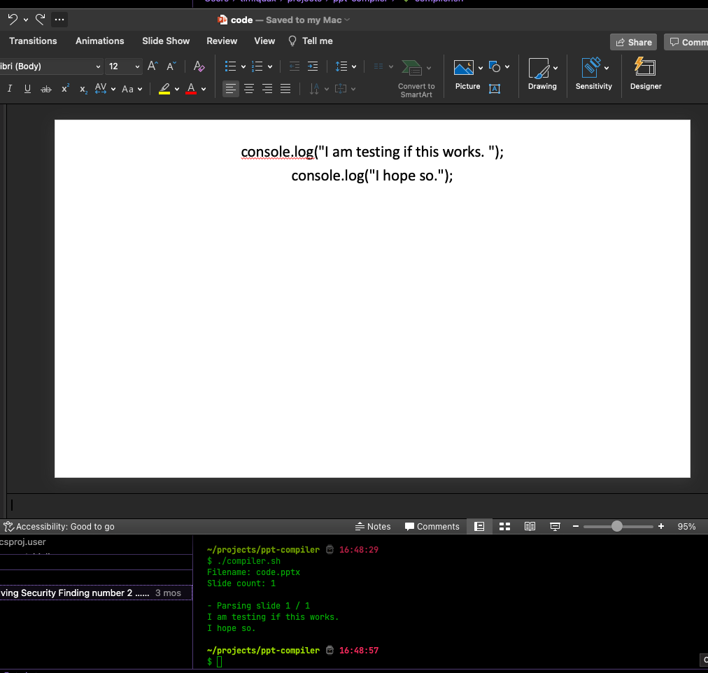

# Powerpoint to Node.js Compiler
Write code in your favorite Powerpoint editor and compile very easily into proper Node.js. That's right, the future is now.



## Getting started
There are two steps:

1) Write code in Powerpoint
2) Compile and run as Node.js

That's it. Call the bash script with one argument, the pptx filename, to compile and run your Powerpoint slides. I should mention it's only been tested on Mac.

## Example
```bash
$ ./compiler.sh code.pptx
Filename: code.pptx
Slide count: 1

- Parsing slide 1 / 1

------------------------

I am testing if this works. 
I hope so.
```
